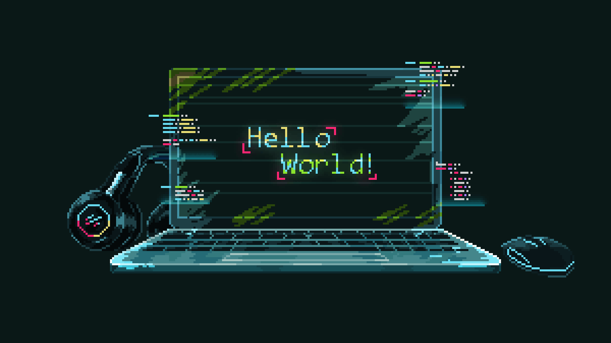

<div align="center">
   
[](https://git.io/typing-svg)

</div>



```yaml
name: Amr Riyad
mail: amrriyad89@gmail.com
company: Kyklo
title: Backend Dev
interests:
  - Linux
  - Back-End Dev
programming-languages:
  - c++
  - Ruby
  - Go
```

<p align="center">
<a href="mailto:amrriyad89@gmail.com">
  
</a>
<a href="#">
  
</a>
</p>
